<p align="center">
  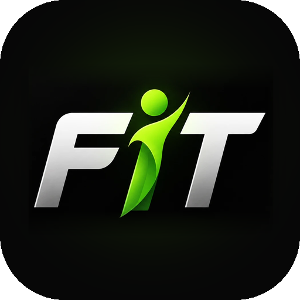
</p>

<h1 align="center">FiT</h1>

<p align="center">
  <b>One app for nutrition, gym, steps, sleep and skin, with a coach that tells you what to do next.</b><br/>
  <sub>Everyday tracking in <b>General mode</b>, or plan a whole body &amp; skin transformation once and just tick it off in <b>Transformation mode</b>.</sub>
</p>

<p align="center">
  <a href="https://github.com/Shayan1810/FiT-App/releases/latest"></a>
  <a href="https://github.com/Shayan1810/FiT-App/actions/workflows/release.yml"></a>
  
  
  
</p>

<p align="center">
  <a href="https://github.com/Shayan1810/FiT-App/releases/latest/download/FiT-v2.0.0.apk"><b>⬇ Download for Android</b></a>
  &nbsp;·&nbsp;
  <a href="https://github.com/Shayan1810/FiT-App/releases/latest/download/FiT-v2.0.0-unsigned.ipa"><b>⬇ Download for iPhone</b></a>
</p>

<p align="center">
  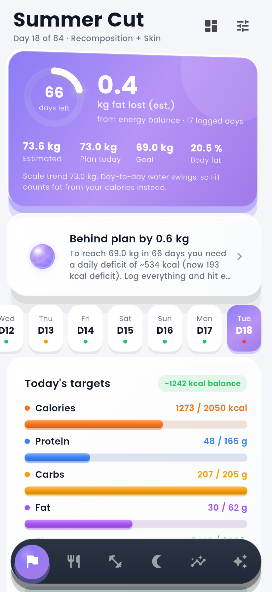
  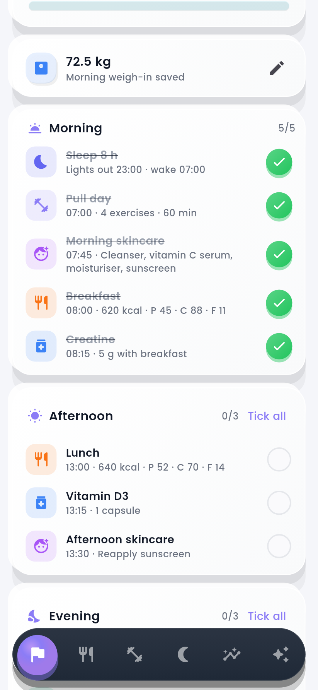
  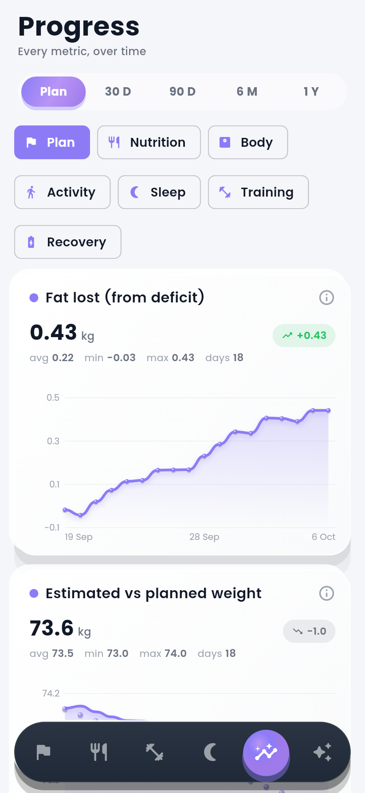
  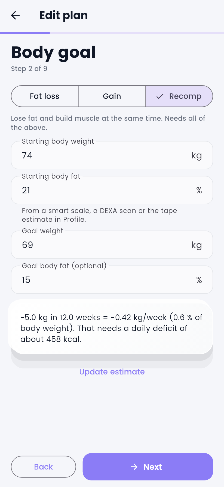
  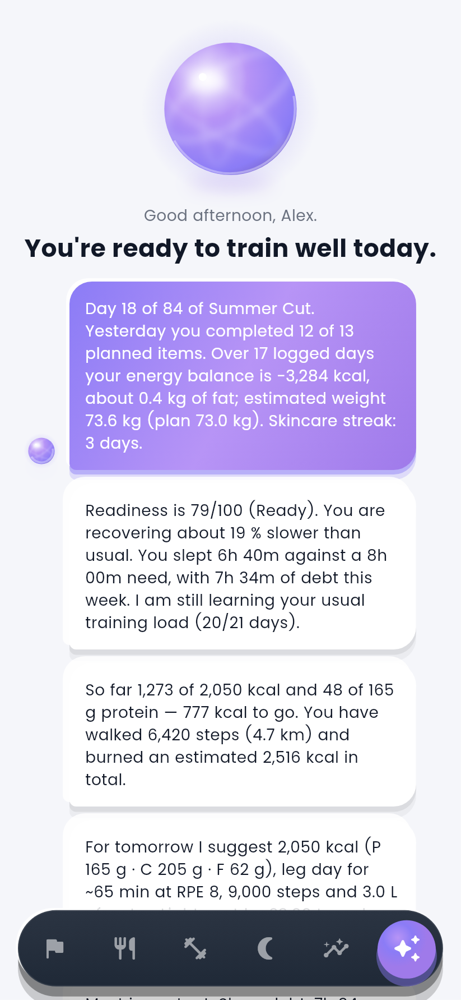
</p>
<p align="center">
  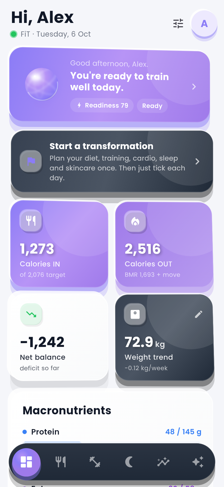
  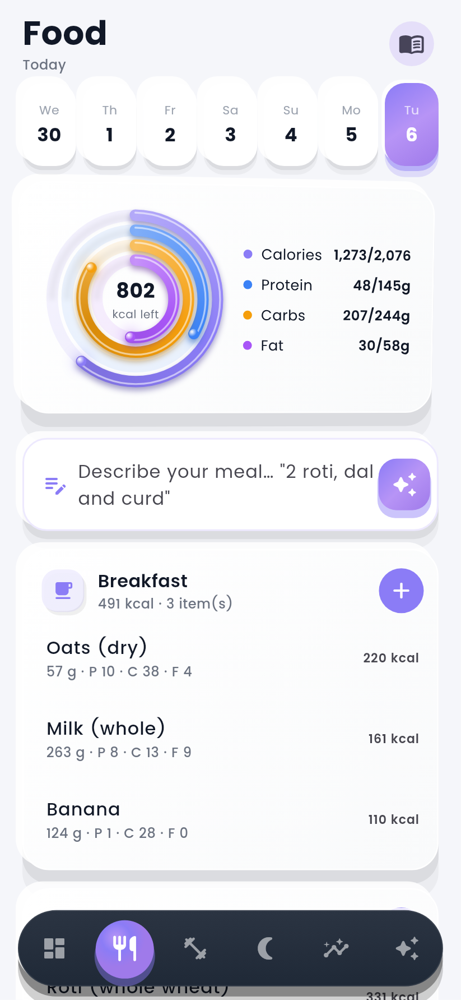
  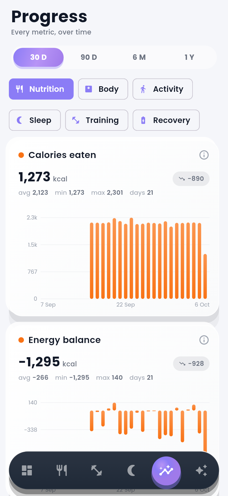
  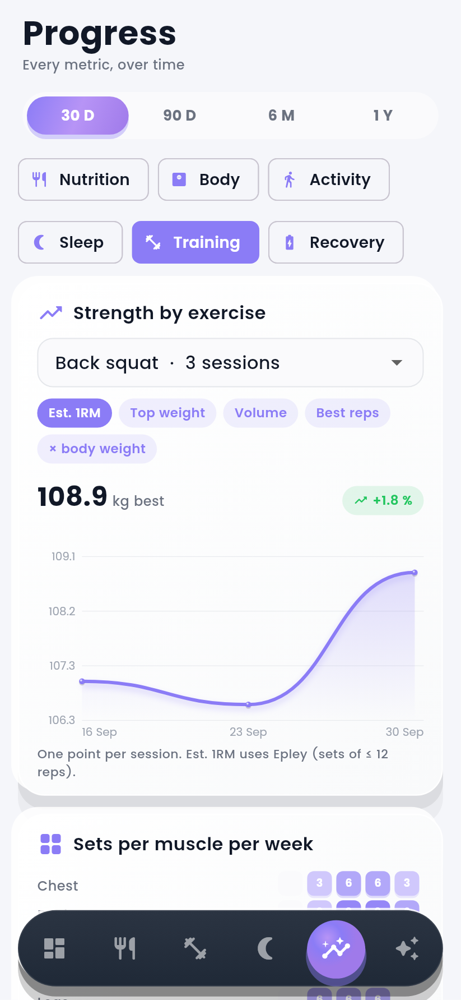
  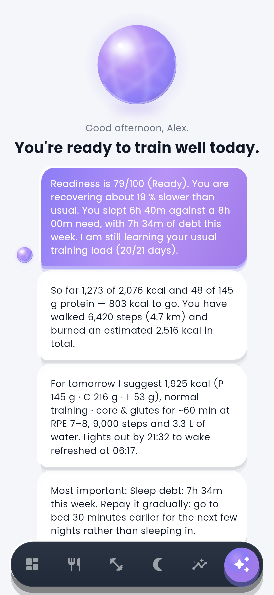
</p>
<p align="center">
  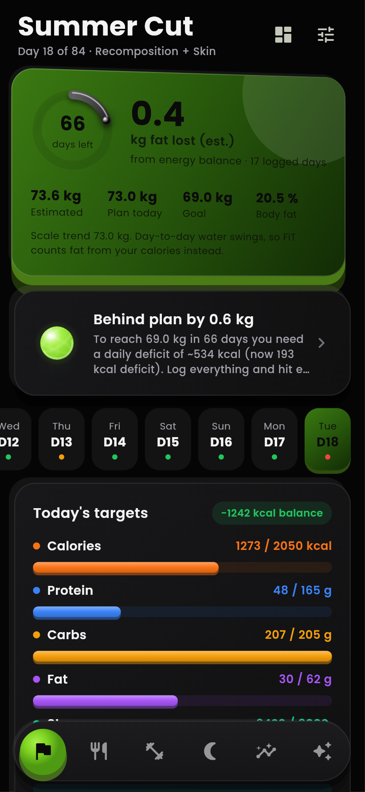
  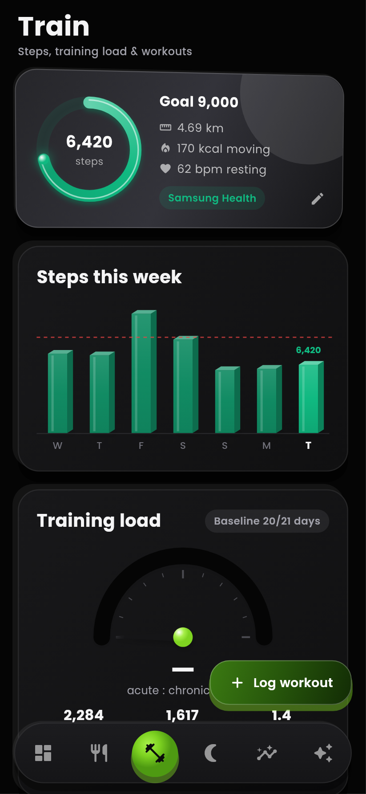
  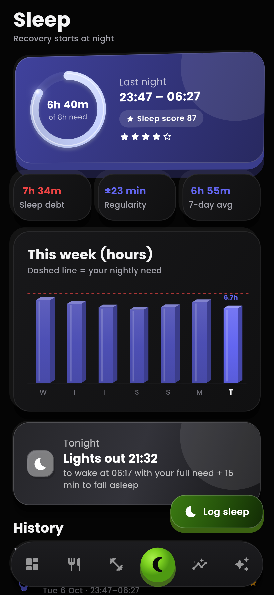
  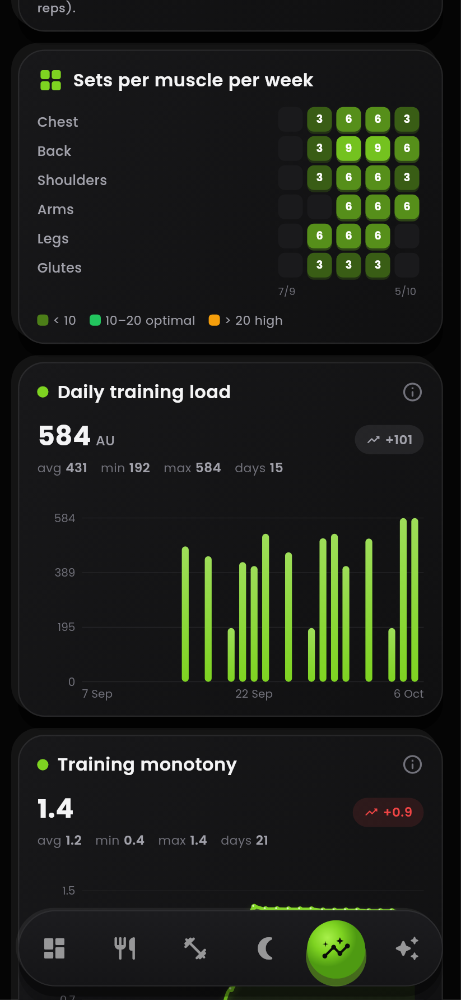
  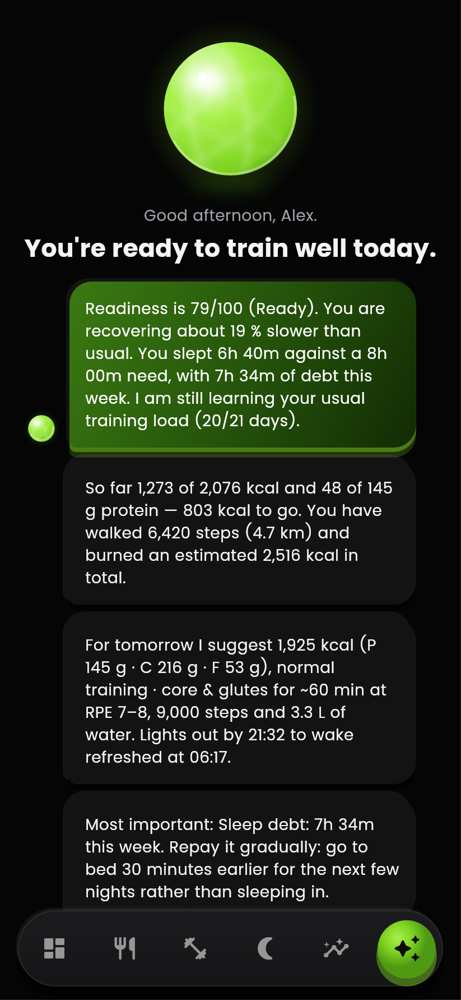
</p>

---

## Why FiT

Most people track food in one app, workouts in another and sleep in a third, and none of them talk to each other. FiT puts everything in one place and adds **Nebula**, a coach that reads all of it every evening and gives you a plan for tomorrow: calories and protein, training focus, step goal and bedtime. Every number comes from a published formula, never a guess.

## Two modes

| | |
|---|---|
| 🧭 **General mode** | Everyday tracking: log what you eat, train, walk and sleep, and Nebula adapts tomorrow's targets to it. |
| 🏁 **Transformation mode** | A time-boxed plan (for example 70 days) for **Body** (fat loss, weight gain or recomposition) and/or **Skin**. You enter everything recurring **once**: meals with macros, workouts per weekday, rest days, cardio sessions, supplements and medicine, sleep times, and your morning, afternoon and evening skincare. Each day becomes a checklist. Ticking an item marks it done and **logs it for you**: meals go to the food diary, workouts and cardio to training, and sleep to sleep. Anything off-plan can still be logged as usual. While it runs, FiT opens on the plan until it ends or you switch back in Settings. |

In Transformation mode you also get:

* **Fat lost / mass gained from energy balance** (7,700 kcal per kg of fat). Water and glycogen move the scale 1–2 kg a day, so the scale is shown only for reference.
* **Estimated vs planned vs scale weight**, estimated body-fat %, and the projected end weight at your current pace.
* **Progress charts limited to the plan period**: plan completion, daily balance, fat lost, skincare and every General-mode metric.
* **Nebula follows the plan**: tomorrow's workout comes from your schedule, adjusted for readiness. It flags missed items, open items in the evening, falling behind plan, streaks and skipped skincare.
* **Import / export**: copy a plan as text to back it up or move it to another phone.

## Features

| | |
|---|---|
| 🍽️ **Nutrition** | Describe a meal in plain words ("2 roti, dal and curd") and get calories and macros. Save your own foods and recipes; they are recognised offline. Water tracking. |
| 🏋️ **Training** | Log gym sessions from a 55+ exercise library or **create your own exercises**. The duration is estimated automatically. Training load (session RPE), per-muscle weekly sets and muscle recovery status. |
| 👟 **Steps** | Imported from **Samsung Health** (Health Connect) or **Apple Health**, or typed in manually. Any day can be edited, and your edit is never overwritten by a sync. |
| 🌙 **Sleep** | Imported or logged manually, and every night is editable. Sleep need by age, 7-day sleep debt, regularity and a suggested bedtime. |
| 📈 **Progress** | Every metric over 30 days to 1 year: protein per kg, energy balance, training load, ACWR, monotony, volume, **est. 1RM / top weight / volume / relative strength for every exercise**, sets-per-muscle heat-map, sleep regularity, sleep debt, daily readiness and recovery speed. |
| 🧠 **Nebula coach** | Readiness score and a **recovery-speed factor** that accounts for sleep, under-eating, low protein, age and recent training damage. Tomorrow's targets and plan, explained in plain language. |
| 🌗 **Light & dark** | A purple light theme and a black + lime dark theme that matches the logo. You can switch in Settings or follow the system. |
| 🏁 **Transformation plans** | Goals, targets, a full weekly schedule and a daily checklist that logs itself. See [Two modes](#two-modes). |
| 🔒 **Private & offline** | Everything is stored on your phone. AI meal recognition (Google Gemini) is optional and only used for foods FiT doesn't already know. |

## The science

| Metric | Method |
|---|---|
| Energy needs | Mifflin–St Jeor (or Katch–McArdle with body fat), NEAT from steps, exercise METs, an adaptive TDEE from your weight trend |
| Weight trend | Exponential moving average (α = 0.1), which filters out day-to-day water swings |
| Protein target | 1.6–2.2 g/kg depending on goal (Morton 2018; Helms 2014) |
| Training load | Session RPE × minutes (Foster 2001) |
| Injury-risk ratio | EWMA acute:chronic workload (Williams 2017). Reported only after a 21-day baseline and above a minimum absolute load, so one light session can never show as a risk |
| Transformation progress | Cumulative energy balance ÷ 7,700 kcal per kg of fat lost (Hall 2008), or ÷ 5,500 kcal per kg of tissue gained with training (Forbes 1987; Slater 2019) |
| Recovery speed | Sleep (Lamon 2021), energy availability (Areta 2014), protein (Morton 2018), age and recent load, combined into one factor that scales each muscle's 48–72 h recovery window |
| Sleep | Need by age (NSF), 7-day debt, mid-point regularity (Phillips 2017) |
| Strength | Estimated 1RM using Epley's formula (sets of 12 reps or fewer) |

## Install

### Android
1. On your phone, download **[FiT-v2.0.0.apk](https://github.com/Shayan1810/FiT-App/releases/latest/download/FiT-v2.0.0.apk)**.
2. Open it and allow *Install unknown apps* when asked.
3. *Optional:* in **Samsung Health → Settings → Health Connect**, turn sync on, then tap **Train → Connect** in FiT.

### iPhone
FiT isn't on the App Store yet, so the iPhone build is installed by sideloading:
1. On a computer, download **[FiT-v2.0.0-unsigned.ipa](https://github.com/Shayan1810/FiT-App/releases/latest/download/FiT-v2.0.0-unsigned.ipa)**.
2. Install it with [AltStore](https://altstore.io) or [Sideloadly](https://sideloadly.io) using your Apple ID. With a free Apple ID the app must be refreshed every 7 days.
3. *Optional:* tap **Train → Connect** in FiT and allow Apple Health access.

## Build from source

```bash
git clone https://github.com/Shayan1810/FiT-App.git
cd FiT-App/fit
flutter pub get
flutter test                  # unit, widget and performance tests
flutter run                   # Flutter 3.47+, Android or iOS device/emulator
flutter build apk --release   # Android
flutter build ios --release   # iOS (macOS + Xcode)
```

AI meal recognition is optional: add a free Gemini key in **Settings**, or build with `--dart-define=GEMINI_API_KEY=...`.

## Architecture

```
fit/lib
├── core/          DI (get_it), Hive storage, theme & 3D widget kit, networking, retry policy
└── features/
    ├── nutrition/     foods, recipes, meal parser, Gemini client, offline queue
    ├── workout/       sessions, exercise library + custom exercises
    ├── activity/      steps & distance (device or manual)
    ├── sleep/         nights (device or manual)
    ├── health_sync/   Health Connect / HealthKit import
    ├── insights/      calculators + InsightEngine (runs in a background isolate)
    ├── progress/      long-range metric series (background isolate)
    ├── transformation/  plans, daily checklist, auto-logging ticks, energy-balance progress
    ├── coach/ dashboard/ profile/ settings/ onboarding/ shell/
```

* **Clean Architecture**: each feature has `domain/` (entities, repositories, use cases), `data/` (Hive and APIs) and `presentation/` (BLoC/Cubit + UI).
* **Offline-first**: Hive CE storage with measured CRUD of 0.04–0.55 ms per operation. Unresolved meals are queued and retried automatically when you're back online.
* **Never blocks the UI**: the coach and the Progress analytics run in `Isolate.run`.
* **Meal analysis pipeline**: cache → offline parser (your foods and recipes) → Gemini with a JSON schema and exponential backoff → offline queue. Tested at ≥ 99.5 % success with a 30 % failure rate injected.

## Contributing

Issues and pull requests are welcome. See [CONTRIBUTING.md](CONTRIBUTING.md) and the [changelog](CHANGELOG.md).

## Author

Made by **Shayan Zafar** ([@Shayan1810](https://github.com/Shayan1810)) · MDG Nebula Project. Questions and ideas: [open an issue](https://github.com/Shayan1810/FiT-App/issues).

> FiT's advice is educational and based on published research. It is not medical advice.
